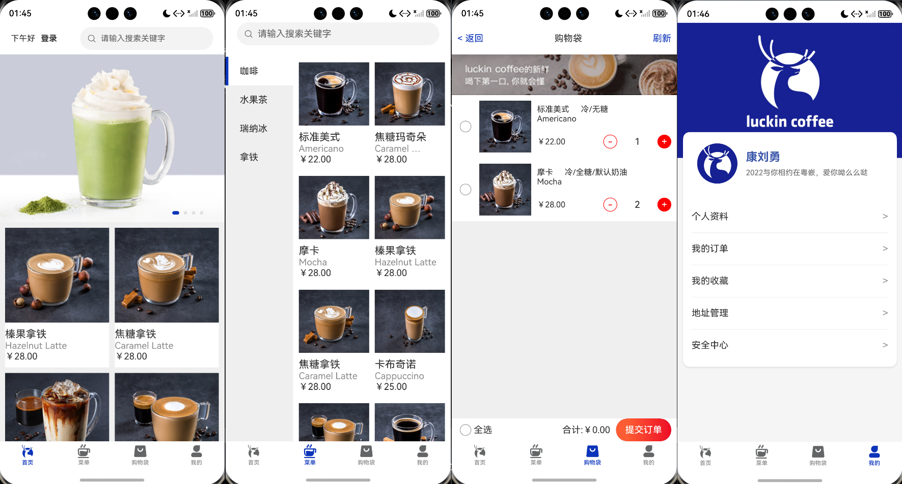
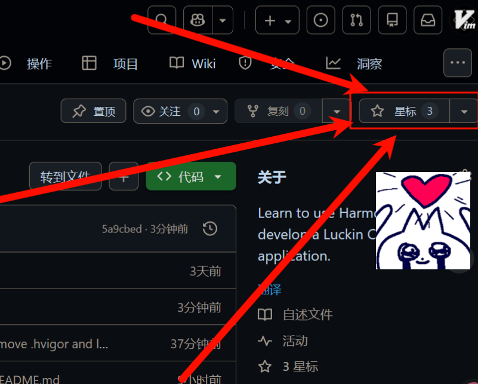

# ☕ HarmonyOS Luckin Coffee (瑞幸咖啡仿制版)

<p align="center">
    
    
    
    
    <br/>
    <br/>
    <span>👤 <strong>Author</strong>: <a href="https://github.com/Leivmox">Leivmox</a></span>
    &nbsp;&nbsp;|&nbsp;&nbsp;
    <span>🏠 <strong>Repo</strong>: <a href="https://github.com/Leivmox/HarmonyOS-Coffee">HarmonyOS-Coffee</a></span>
</p>

## 📖 项目介绍 | Introduction

本项目是基于 **HarmonyOS (OpenHarmony)** 开发的瑞幸咖啡（Luckin Coffee）App 仿制版本。项目采用 **ArkTS** 语言和 **ArkUI** 声明式开发范式，旨在还原瑞幸咖啡客户端的核心功能与 UI 交互体验。

* **项目作者**: [Leivmox](https://github.com/Leivmox)
* **开源地址**: [https://github.com/Leivmox/HarmonyOS-Coffee](https://github.com/Leivmox/HarmonyOS-Coffee)

### 🔌 后端接口 | API Source

本项目数据来源于 **康刘勇老师** 提供的在线咖啡商城接口，特此感谢！

* **接口基地址**: `https://apis.netstart.cn/coffee/`
* **作者主页**: [https://www.kangliuyong.com/](https://www.kangliuyong.com/)

> ⚠️ **注意**： 接口服务全站设有 **10分钟缓存**。如果您在进行增删改操作（如修改地址、提交订单）后未立即看到变化，请稍作等待或尝试刷新，属于正常现象。

本项目仅供学习和交流 HarmonyOS 开发技术使用，不用于任何商业用途。

## 📸 运行演示 | Screenshots

> 

## ✨ 核心功能 | Features

根据项目文件结构，目前已实现以下核心模块：

* **用户体系 (User System)**
    * 用户登录 (`LoginPage`) & Token 管理
    * 个人信息展示与修改 (`PersonalInfo`)
    * 安全中心 (`SafetyCenter`)
* **商品业务 (Product)**
    * 首页 Banner 与推荐 (`Home`)
    * 饮品菜单分类浏览 (`Menu`)
    * 商品详情页展示 (`DetailPage`)
    * 商品搜索 (`SearchPage`)
    * 我的收藏 (`MyCollect`)
* **订单流程 (Order Flow)**
    * 购物车管理 (`ShopBag`)：添加、删除、数量变更
    * 订单结算 (`OrderSettle`)
    * 订单列表与状态 (`MyOrders`)
* **地址管理 (Address)**
    * 收货地址列表 (`AddressManage`)
    * 新增地址 (`AddressAdd`)
    * 编辑地址 (`AddressEdit`)

## 🛠️ 技术栈 | Tech Stack

* **开发环境**: DevEco Studio
* **开发语言**: ArkTS
* **UI 框架**: ArkUI (eTS)
* **网络请求**: 基于 `http` 模块封装的 Promise 请求工具 (`request.ets`)
* **状态管理**: AppStorage / LocalStorage
* **数据持久化**: Preferences (`storage.ets`)
* **工具类**: 防抖处理 (`debounce.ets`)、表单验证 (`validform.ets`)

## 📂 目录结构 | Project Structure

```text
entry/src/main/ets
├── api/                # 接口请求定义 (api.ets, request.ets)
├── entryability/       # 应用入口能力
├── model/              # 数据模型定义
├── pages/              # 页面级组件 (Pages)
│   ├── Index.ets           # 应用主入口(Tabs容器)
│   ├── LoginPage.ets       # 登录页
│   ├── DetailPage.ets      # 商品详情
│   ├── ShopBag.ets         # 购物车
│   ├── MyOrders.ets        # 订单列表
│   ├── AddressManage.ets   # 地址管理
│   └── ...
├── views/              # 视图组件/Tab页签 (Views)
│   ├── Home.ets            # 首页视图
│   ├── Menu.ets            # 菜单视图
│   ├── ShopBag.ets         # 购物车视图
│   └── My.ets              # 我的视图
└── utils/              # 工具类 (防抖, 存储, 验证)

```


